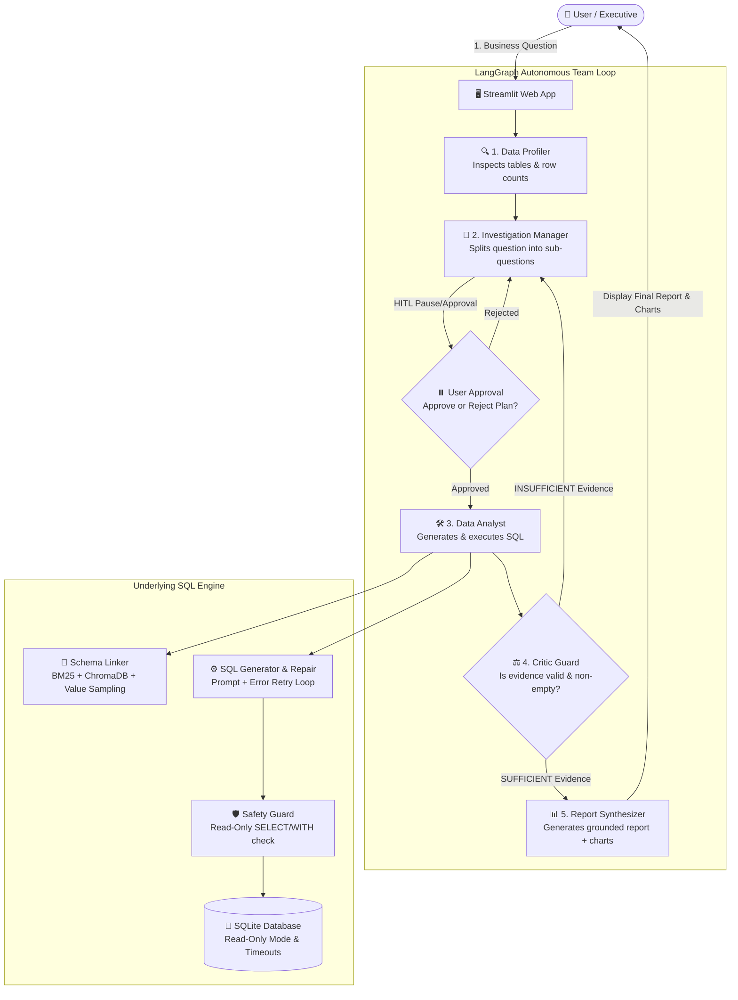

# 🧠 QueryMind — Multi-Agent Autonomous Data Analyst

[](https://www.python.org/downloads/)
[](https://github.com/langchain-ai/langgraph)
[](https://www.sqlite.org/)
[](LICENSE)

**QueryMind** is an open-source, multi-agent **Autonomous Data Analyst** system built with Python, **LangGraph**, **SQLite**, and **Google Gemini** (or other provider-swappable LLMs). It investigates complex business questions over relational databases by planning, generating & repairing SQL queries, validating evidence, and synthesizing grounded reports with visual charts.

---

## 🌟 Key Features

* 🧠 **Multi-Agent Orchestration**: Built on LangGraph with a cyclic loop (**Profiler → Manager → Analyst → Critic → Report**).
* 🛡️ **Hard Anti-Hallucination Critic Guard**: Deterministic rule preventing empty or broken query results from being accepted as valid evidence.
* 🔗 **Hybrid Schema Linking**: Combines BM25 lexical token overlap, ChromaDB vector embeddings, and distinct column value sampling to retrieve relevant tables.
* ⚙️ **Self-Repairing SQL Engine**: Automatically captures execution syntax errors and feeds them back into the LLM prompt to fix SQL queries (up to 3 retries).
* 🔒 **Strict Read-Only Enforcement**: Executes queries via SQLite `?mode=ro`, enforces runtime timeouts (`QUERY_TIMEOUT_S`), caps returned rows, and blocks mutation keywords (`INSERT`, `DROP`, `UPDATE`).
* 📊 **Automated Chart Generation**: Automatically detects chartable multi-row tabular evidence and renders interactive bar charts in the Streamlit UI.
* ⏸️ **Human-in-the-Loop (HITL)**: Pause execution before query execution to let users review, approve, or reject proposed investigation plans.
* 📁 **Machine-Readable Run Tracing**: Exports complete structured logs (`logs/traces/trace_<timestamp>.json`) for auditability.

---

## 🏗️ Architecture Overview



---

## 🛠️ Quickstart Guide

### 1. Prerequisites & Virtual Environment Setup
```bash
# Clone the repository
git clone https://github.com/your-username/QueryMind.git
cd QueryMind

# Create and activate virtual environment
python -m venv .venv
# On Windows:
.venv\Scripts\activate
# On macOS/Linux:
source .venv/bin/activate

# Install dependencies in editable mode
pip install -e .[dev]
```

### 2. Environment Variables Configuration
Copy `.env.example` to `.env` and set your API key:
```env
GEMINI_API_KEY=your_google_gemini_api_key_here
QUERYMIND_LLM_PROVIDER=gemini
QUERYMIND_LLM_MODEL=gemini-2.0-flash
```

### 3. Launch Interactive Streamlit UI
```bash
streamlit run src/querymind/app.py
```
Open your browser at `http://localhost:8501`.

---

## 🧪 Testing & Evaluation

### Run Pytest Verification Suite
```bash
pytest
```
*Runs all 24 unit, graph, engine, and UI Playwright integration tests.*

### Run BIRD Benchmark Evaluation
```bash
# Plumbing check with Gold SQL over student_club benchmark
python -m querymind.eval --gold --db-id student_club --out eval_results/student_club_gold.json

# Run 5-Rung Ablation Study
python -m querymind.eval.ablation --gold --db-id student_club --out eval_results/ablation_summary.json
```

---

## 📂 Project Structure

```
QueryMind/
├── data/                    # BIRD Mini-Dev benchmark SQLite databases
├── eval_results/            # Generated benchmark evaluation JSON reports
├── logs/traces/             # Persistent structured run trace logs
├── project docs/            # Architecture analysis, PRD, SPEC & Implementation plan
│   ├── QUERYMIND_ANALYSIS.md
│   ├── QUERYMIND_ANALYSIS.docx
│   ├── QUERYMIND_IMPLEMENTATION_PLAN.md
│   └── QUERYMIND_IMPLEMENTATION_PLAN.docx
├── src/querymind/
│   ├── agents/              # Manager, Critic, Report agents
│   ├── engine/              # SQLEngine, SchemaLinker, DBExecutor, Safety Guard
│   ├── eval/                # Evaluation harness & ablation study
│   ├── graph/               # LangGraph builder & state definition
│   ├── llm/                 # LLM Client wrapper with rate-limit retry & SQLite caching
│   ├── utils/               # Structured trace logger
│   └── app.py               # Streamlit web application
└── tests/                   # Unit, graph, engine, and Playwright UI tests
```

---

## 📜 License
Distributed under the MIT License. See `LICENSE` for details.
